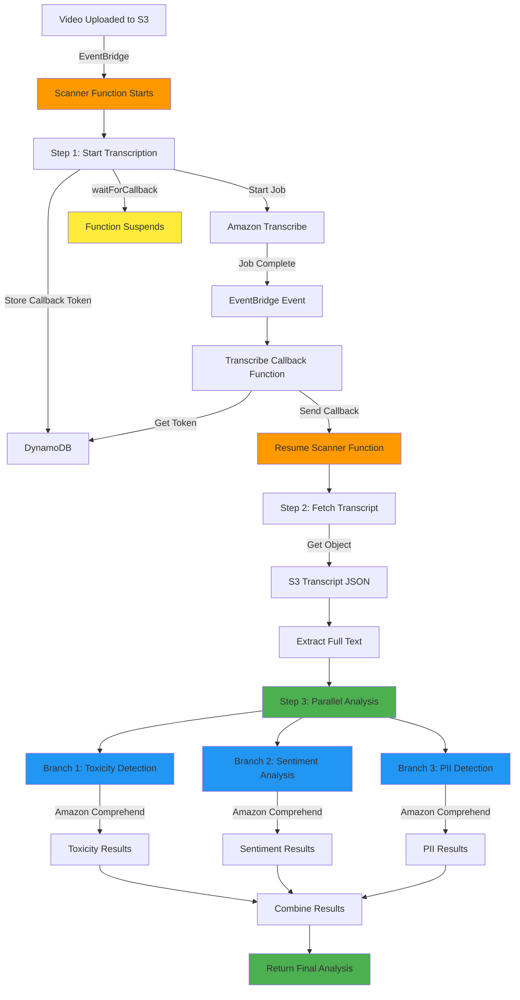

# Video Scanner - Content Analysis Pipeline

A serverless video content analysis pipeline built with AWS Lambda Durable Functions, Amazon Transcribe, and Amazon Comprehend.

## Overview

This application automatically processes video files uploaded to S3, transcribes the audio, and performs comprehensive content analysis including toxicity detection, sentiment analysis, and PII detection.

## Architecture

The system uses AWS Lambda Durable Functions to orchestrate a multi-step workflow that can run for extended periods while maintaining state and handling failures gracefully.

### Workflow Diagram



**Legend:**
- 🟠 Orange: Durable Function Execution
- 🟡 Yellow: Function Suspended (No Compute Charges)
- 🟢 Green: Parallel Execution / Completion
- 🔵 Blue: Concurrent Analysis Branches

### Components

- **Scanner Function** (Durable): Main orchestrator that coordinates the entire workflow
- **Transcribe Callback Function**: Handles Amazon Transcribe completion events
- **S3 Bucket**: Stores uploaded videos and transcription results
- **DynamoDB Table**: Manages callback tokens for durable execution
- **EventBridge**: Routes S3 and Transcribe events to Lambda functions

## Durable Function Workflow

The Scanner function implements a fault-tolerant, multi-step workflow using AWS Lambda Durable Functions:

### Step 1: Start Transcription Job
```
context.waitForCallback('transcription-result', async (callbackToken) => {
  // Store callback token in DynamoDB
  // Start Amazon Transcribe job
  // Job completion triggers callback via EventBridge
})
```

**What happens:**
- Receives S3 object created event for videos in `raw/` prefix
- Generates unique transcription job name
- Stores callback token in DynamoDB with 24-hour TTL
- Starts Amazon Transcribe job with job name as correlation ID
- Function suspends (no compute charges) while waiting for transcription
- Transcribe completion event triggers callback function
- Callback function sends result back to durable execution
- Function resumes with transcription result

### Step 2: Fetch Transcript from S3
```
context.step('fetch-transcript', async () => {
  // Parse transcript URI (supports s3:// and https:// formats)
  // Fetch transcript JSON from S3
  // Extract full text from transcript
})
```

**What happens:**
- Parses the transcript URI from Transcribe result
- Handles both S3 URI (`s3://bucket/key`) and HTTPS URL formats
- Fetches the transcript JSON file from S3
- Extracts the full transcript text
- Returns text and metadata for next step

### Step 3: Parallel Content Analysis
```
context.parallel([
  async () => { /* Toxicity Detection */ },
  async () => { /* Sentiment Analysis */ },
  async () => { /* PII Detection */ }
])
```

**What happens:**
All three analyses run concurrently using Amazon Comprehend:

#### Branch 1: Toxicity Detection
- Detects 7 types of toxic content:
  - PROFANITY
  - HATE_SPEECH
  - INSULT
  - GRAPHIC
  - HARASSMENT_OR_ABUSE
  - SEXUAL
  - VIOLENCE_OR_THREAT
- Handles large texts by chunking (100KB limit per request)
- Returns confidence scores for each category
- Flags content as toxic if any score > 0.5

#### Branch 2: Sentiment Analysis
- Analyzes overall emotional tone
- Returns sentiment: POSITIVE, NEGATIVE, NEUTRAL, or MIXED
- Provides confidence scores for each sentiment type
- Analyzes first 5KB if text exceeds limit

#### Branch 3: PII Detection
- Detects personally identifiable information:
  - Names
  - Phone numbers
  - Email addresses
  - Credit card numbers
  - SSNs
  - Addresses
  - And more
- Groups entities by type for easy summary
- Returns count, types, and locations of all PII found
- Analyzes first 100KB if text exceeds limit

### Final Result Structure

```json
{
  "transcriptionResult": { /* Transcribe callback data */ },
  "transcriptData": {
    "fullText": "...",
    "transcriptUri": "s3://..."
  },
  "analysis": {
    "toxicity": {
      "hasToxicContent": false,
      "labels": [
        { "Name": "PROFANITY", "Score": 0.019 },
        { "Name": "HATE_SPEECH", "Score": 0.127 }
      ],
      "chunked": false
    },
    "sentiment": {
      "sentiment": "NEGATIVE",
      "sentimentScore": {
        "Positive": 0.053,
        "Negative": 0.893,
        "Neutral": 0.051,
        "Mixed": 0.003
      },
      "truncated": false
    },
    "pii": {
      "hasPII": true,
      "entityCount": 3,
      "entityTypes": { "NAME": 1, "PHONE": 2 },
      "entities": [
        { "type": "NAME", "score": 0.999, "beginOffset": 18, "endOffset": 30 }
      ]
    }
  },
  "objectKey": "raw/video.mp4",
  "objectSize": 12345,
  "status": "completed"
}
```

## Key Features

### Durable Execution Benefits
- **Automatic Checkpointing**: Each step is checkpointed, allowing recovery from any point
- **Long-Running Workflows**: Can run for up to 1 year with automatic state management
- **No Compute Charges During Waits**: Function suspends while waiting for Transcribe
- **Fault Tolerance**: Automatic retry and recovery from failures
- **Parallel Execution**: Multiple analyses run concurrently for faster results

### Content Analysis
- **Comprehensive Safety Checks**: Toxicity detection for content moderation
- **Emotional Intelligence**: Sentiment analysis for understanding tone
- **Privacy Protection**: PII detection for compliance and data protection
- **Scalable**: Handles large transcripts with automatic chunking

## Deployment

### Prerequisites
- AWS SAM CLI installed
- AWS credentials configured
- Node.js 24.x runtime

### Deploy with SAM Sync
```bash
sam sync --watch
```

This command:
- Builds the Lambda functions
- Deploys infrastructure changes
- Watches for code changes and auto-deploys

### Upload a Video
```bash
aws s3 cp video.mp4 s3://YOUR-BUCKET-NAME/raw/video.mp4
```

The workflow automatically triggers when a file is uploaded to the `raw/` prefix.

## Monitoring

### CloudWatch Logs
Each function logs detailed information:
- Scanner function: `/aws/lambda/scanner-function`
- Callback function: `/aws/lambda/transcribe-callback-function`

### Key Log Events
- Transcription job started
- Callback token stored/retrieved
- Transcript fetched
- Parallel analysis started
- Individual analysis results
- Final workflow completion

### X-Ray Tracing
All functions have X-Ray tracing enabled for distributed tracing and performance analysis.

## Resources Created

- **Lambda Functions**: 2 (Scanner, Transcribe Callback)
- **S3 Bucket**: 1 (with EventBridge notifications enabled)
- **DynamoDB Table**: 1 (callback tokens with TTL)
- **IAM Roles**: Automatically created with least-privilege permissions
- **EventBridge Rules**: 2 (S3 object created, Transcribe job completion)

## Cost Optimization

- **Durable Functions**: No compute charges during waits (can be hours/days)
- **ARM64 Architecture**: Better price-performance ratio
- **Pay-per-use**: Only charged for actual processing time
- **Parallel Execution**: Faster results, less total execution time

## Security

- **Encryption**: DynamoDB encryption at rest, S3 encryption
- **IAM Policies**: Least-privilege access using SAM policy templates
- **VPC**: Can be deployed in VPC for additional isolation
- **Secrets**: Callback tokens stored securely in DynamoDB with TTL

## Development

### Project Structure
```
.
├── src/
│   ├── scanner/              # Durable function orchestrator
│   │   ├── index.ts
│   │   ├── package.json
│   │   └── tsconfig.json
│   └── transcribe-callback/  # Transcribe event handler
│       ├── index.ts
│       ├── package.json
│       └── tsconfig.json
├── template.yaml             # SAM template
└── samconfig.toml           # SAM configuration
```

### Local Testing
```bash
# Invoke scanner function locally
sam local invoke ScannerFunction -e events/s3-event.json

# Start local API
sam local start-api
```

## Troubleshooting

### Transcription Timeout
- Default callback timeout: 10 minutes
- Adjust in `CALLBACK_CONFIG.timeoutSeconds` if needed

### Large Transcript Handling
- Toxicity: Automatically chunks at 100KB
- Sentiment: Analyzes first 5KB
- PII: Analyzes first 100KB

### Callback Token Not Found
- Check DynamoDB table for token
- Verify TTL hasn't expired (24 hours)
- Check EventBridge rule is triggering callback function

## License

Apache 2.0
