# Video Scanner - Content Analysis Pipeline

A serverless video content analysis pipeline built with AWS Lambda Durable Functions, demonstrating advanced orchestration patterns for long-running workflows with human-in-the-loop approval.

## Overview

This application automatically processes video files uploaded to S3, performing comprehensive content analysis through a multi-step durable workflow that can run for days while maintaining state. It demonstrates key durable function patterns including parallel execution, async callbacks, and human approval workflows.

## Architecture

The system uses AWS Lambda Durable Functions to orchestrate a multi-step workflow that can run for up to 7 days while maintaining state and handling failures gracefully. The workflow demonstrates key patterns: parallel execution with child contexts, async callbacks for AWS service jobs, and human-in-the-loop approval with timeout handling.

### Complete Workflow Diagram

```mermaid
graph TB
    START[Video Upload to S3] -->|EventBridge Rule| INIT[Scanner Function Invoked]
    
    INIT --> STEP0[Step 0: Generate Scan ID]
    STEP0 --> EVENT1[Publish: SCAN_STARTED]
    
    EVENT1 --> PARALLEL1{Parallel Execution<br/>Steps 1-4}
    
    PARALLEL1 -->|Branch 1| TRANS1[Step 1: Start Transcription]
    PARALLEL1 -->|Branch 2| REK1[Step 3: Start Rekognition]
    
    TRANS1 -->|Setup Function| TRANS1A[Store Callback Token<br/>DynamoDB TTL: 24h]
    TRANS1A --> TRANS1B[Start Transcribe Job<br/>Job Name: transcribe-timestamp-scanId]
    TRANS1B --> TRANS1C[waitForCallback<br/>Timeout: 30 min]
    TRANS1C -->|Function Suspends| WAIT1[⏸️ Waiting]
    
    WAIT1 -->|Job Complete| EB1[EventBridge:<br/>Transcribe Job State Change]
    EB1 --> CB1[Callback Function]
    CB1 --> CB1A[Query DynamoDB<br/>Get Callback Token]
    CB1A --> CB1B[SendDurableExecutionCallbackSuccess]
    CB1B --> RESUME1[✅ Branch 1 Resumes]
    
    RESUME1 --> TRANS2[Step 2: Fetch Transcript]
    TRANS2 --> TRANS2A[GetTranscriptionJob API]
    TRANS2A --> TRANS2B[Parse Transcript URI]
    TRANS2B --> TRANS2C[Fetch JSON from S3]
    TRANS2C --> TRANS2D[Extract Full Text + Timestamps]
    
    REK1 -->|Setup Function| REK1A[Store Callback Token<br/>DynamoDB TTL: 24h]
    REK1A --> REK1B[Start Rekognition Job<br/>Job Name: rekognition-timestamp-scanId]
    REK1B --> REK1C[waitForCallback<br/>Timeout: 30 min]
    REK1C -->|Function Suspends| WAIT2[⏸️ Waiting]
    
    WAIT2 -->|Job Complete| SNS1[SNS Topic:<br/>Rekognition Notification]
    SNS1 --> CB2[Callback Function]
    CB2 --> CB2A[Query DynamoDB<br/>Get Callback Token]
    CB2A --> CB2B[SendDurableExecutionCallbackSuccess]
    CB2B --> RESUME2[✅ Branch 2 Resumes]
    
    RESUME2 --> REK2[Step 4: Fetch Video Text]
    REK2 --> REK2A[GetTextDetection API<br/>Handle Pagination]
    REK2A --> REK2B[Filter by Confidence >80%]
    REK2B --> REK2C[Deduplicate Text Across Frames]
    REK2C --> REK2D[Extract Text + Timestamps + Bounding Boxes]
    
    TRANS2D --> MERGE1[Parallel Results Merge]
    REK2D --> MERGE1
    
    MERGE1 --> EVENT2[Publish: TRANSCRIPTION_COMPLETED]
    EVENT2 --> EVENT3[Publish: REKOGNITION_COMPLETED]
    
    EVENT3 --> STEP5[Step 5: Build Combined Corpus]
    STEP5 --> STEP5A[Combine Audio + Screen Text]
    STEP5A --> STEP5B[Create Position Index<br/>Map Each Word to Source]
    STEP5B --> STEP5C[Preserve Timestamps]
    
    STEP5C --> PARALLEL2{Parallel Analysis<br/>Step 6}
    
    PARALLEL2 --> TOX[Toxicity Detection]
    PARALLEL2 --> SENT[Sentiment Analysis]
    PARALLEL2 --> PII[PII Detection]
    
    TOX --> TOX1[Comprehend DetectToxicContent]
    TOX1 --> TOX2[7 Categories:<br/>Profanity, Hate Speech, Insult,<br/>Graphic, Harassment, Sexual, Violence]
    TOX2 --> TOX3[Auto-chunk if >100KB]
    
    SENT --> SENT1[Comprehend DetectSentiment]
    SENT1 --> SENT2[Returns: POSITIVE, NEGATIVE,<br/>NEUTRAL, MIXED]
    SENT2 --> SENT3[Analyze first 5KB]
    
    PII --> PII1[Comprehend DetectPiiEntities]
    PII1 --> PII2[Detects: Names, Emails, SSN,<br/>Credit Cards, Addresses, etc.]
    PII2 --> PII3[Analyze first 100KB]
    
    TOX3 --> MERGE2[Analysis Results Merge]
    SENT3 --> MERGE2
    PII3 --> MERGE2
    
    MERGE2 --> EVENT4[Publish: ANALYSIS_COMPLETED]
    
    EVENT4 --> STEP7[Step 7: Map to Sources]
    STEP7 --> STEP7A[Use Position Index]
    STEP7A --> STEP7B[Identify PII Source:<br/>Audio vs Screen]
    STEP7B --> STEP7C[Create Source Breakdown]
    
    STEP7C --> STEP8[Step 8: Generate AI Summary]
    STEP8 --> STEP8A[Build Structured Prompt]
    STEP8A --> STEP8B[Bedrock Nova Lite<br/>global.amazon.nova-2-lite-v1:0]
    STEP8B --> STEP8C[3-4 Sentence Summary]
    STEP8C --> STEP8D[Safety Assessment:<br/>SAFE / CAUTION / UNSAFE]
    
    STEP8D --> STEP9[Step 9: Save Results]
    STEP9 --> STEP9A[Generate scanId UUID]
    STEP9A --> STEP9B[Determine Overall Assessment]
    STEP9B --> STEP9C[Save JSON Report to S3<br/>reports/scanId.json]
    STEP9C --> STEP9D[Save Metadata to DynamoDB]
    STEP9D --> STEP9E[Set Status: PENDING_REVIEW<br/>GSI1: USER#userId<br/>GSI2: STATUS#PENDING_REVIEW]
    
    STEP9E --> EVENT5[Publish: REPORT_GENERATED]
    EVENT5 --> EVENT6[Publish: PENDING_REVIEW]
    
    EVENT6 --> STEP10[Step 10: Wait for Approval]
    STEP10 --> STEP10A[Store Callback Token<br/>DynamoDB TTL: 3 days]
    STEP10A --> STEP10B[waitForCallback<br/>Timeout: 3 days]
    STEP10B -->|Function Suspends| WAIT3[⏸️ Waiting<br/>Up to 3 Days]
    
    WAIT3 -->|Human Approves/Rejects| API[POST /approval<br/>Callback Function]
    WAIT3 -->|3 Day Timeout| TIMEOUT[Auto-Reject]
    
    API --> CB3[Query DynamoDB<br/>Get Callback Token]
    CB3 --> CB3A[SendDurableExecutionCallbackSuccess<br/>Pass Approval Decision]
    CB3A --> RESUME3[✅ Function Resumes]
    
    TIMEOUT --> TIMEOUT1[Return Auto-Reject Result<br/>reviewedBy: system]
    TIMEOUT1 --> RESUME3
    
    RESUME3 --> STEP11[Step 11: Update Approval Status]
    STEP11 --> STEP11A[Update DynamoDB Record]
    STEP11A --> STEP11B[Set approvalStatus:<br/>APPROVED or REJECTED]
    STEP11B --> STEP11C[Update GSI2:<br/>STATUS#APPROVED or STATUS#REJECTED]
    STEP11C --> STEP11D[Add reviewedBy, reviewedAt, comments]
    
    STEP11D --> EVENT7[Publish: APPROVED or REJECTED]
    
    EVENT7 --> FINAL[Return Final Result]
    FINAL --> END[✅ Workflow Complete]
    
    style INIT fill:#ff9900,stroke:#333,stroke-width:2px
    style PARALLEL1 fill:#4caf50,stroke:#333,stroke-width:2px
    style PARALLEL2 fill:#4caf50,stroke:#333,stroke-width:2px
    style WAIT1 fill:#ffeb3b,stroke:#333,stroke-width:2px
    style WAIT2 fill:#ffeb3b,stroke:#333,stroke-width:2px
    style WAIT3 fill:#ffeb3b,stroke:#333,stroke-width:2px
    style RESUME1 fill:#ff9900,stroke:#333,stroke-width:2px
    style RESUME2 fill:#ff9900,stroke:#333,stroke-width:2px
    style RESUME3 fill:#ff9900,stroke:#333,stroke-width:2px
    style STEP8B fill:#ce93d8,stroke:#333,stroke-width:2px
    style END fill:#4caf50,stroke:#333,stroke-width:2px
```



**Legend:**
- 🟠 Orange: Active Durable Function Execution
- 🟡 Yellow: Function Suspended
- 🟢 Green: Parallel Execution / Completion
- 🟣 Purple: AI Processing (Bedrock)
- ⏸️ Suspension Points: Function pauses, state saved

### Components

- **Scanner Function** (Durable): Main orchestrator implementing the complete 11-step workflow with parallel execution and human approval
- **Callback Function**: Unified handler processing callbacks from three sources:
  - EventBridge events (Transcribe job completion)
  - SNS notifications (Rekognition job completion)  
  - API Gateway (Human approval/rejection decisions)
- **API Functions**:
  - **api-scans**: Handles scan operations (list, get, upload URLs, video URLs, pending reviews)
  - **api-users**: Manages user profiles and admin user operations
- **S3 Bucket**: Stores uploaded videos (`raw/{userId}/`), transcripts, and scan reports (`reports/`)
- **DynamoDB Table**: Single table design with:
  - Callback tokens (with TTL: 24h for jobs, 3 days for approval)
  - Scan results with GSI1 (user-based queries) and GSI2 (approval status queries)
- **EventBridge Rules**: 
  - S3 object creation events (triggers scanner)
  - Transcribe job completion events (triggers callback)
- **SNS Topic**: Rekognition job completion notifications
- **AppSync Events API**: Real-time event publishing for frontend updates
- **Cognito User Pool**: Authentication and authorization

## Durable Function Workflow

The Scanner function implements a fault-tolerant, 11-step workflow using AWS Lambda Durable Functions. Each step is automatically checkpointed, enabling recovery from any point and allowing the workflow to run for up to 7 days.

### Step 0: Generate Scan ID
```typescript
const { scanId, uploadedAt } = await context.step('generate-scan-id', async () => ({
  scanId: uuidv4(),
  uploadedAt: new Date().toISOString(),
}));
```

**What happens:**
- Generates unique scanId (UUID) for tracking
- Captures upload timestamp
- Uses `context.step()` to ensure deterministic replay - same scanId on retries
- Publishes SCAN_STARTED event to AppSync for real-time updates

### Steps 1-4: Parallel Transcription and Rekognition

The first major optimization runs transcription and video text detection in parallel, reducing total wait time by ~50%. Each parallel branch uses its own child context for deterministic replay.

```typescript
const parallelResults = await context.parallel([
  // Branch 1: Transcription workflow
  async (childContext) => {
    const transcriptionResult = await childContext.waitForCallback(...)
    const transcriptData = await childContext.step(...)
    return transcriptData;
  },
  
  // Branch 2: Rekognition workflow  
  async (childContext) => {
    const rekognitionResult = await childContext.waitForCallback(...)
    const videoTextData = await childContext.step(...)
    return { videoTextData, error: null };
  }
])
```

**Why Child Contexts Matter:**
- Each parallel branch receives its own `childContext` parameter
- All operations within a branch must use the child context (not the parent context)
- Ensures deterministic replay when operations execute in different orders
- Follows AWS Durable Execution SDK best practices

#### Branch 1: Transcription Workflow

**Step 1: Start Transcription Job**
```typescript
const transcriptionResult = await childContext.waitForCallback<string>(
  'transcription-result',
  async (callbackToken: string) => {
    // Setup function - idempotent, not deterministic
    await storeCallbackToken(scanId, jobName, callbackToken);
    await transcribe.send(new StartTranscriptionJobCommand({
      TranscriptionJobName: `transcribe-${Date.now()}-${scanId}`,
      // ... configuration
    }));
  },
  { timeout: { seconds: 1800 }, retryStrategy: CALLBACK_RETRY_STRATEGY }
);
```

**What happens:**
- Receives S3 object created event for videos in `raw/{userId}/` prefix
- Generates unique job name with timestamp: `transcribe-${Date.now()}-${scanId}`
- Stores callback token in DynamoDB with 24-hour TTL
- Starts Amazon Transcribe job with job name as correlation ID
- Function suspends (no compute charges) while waiting for transcription
- Transcribe completion event triggers callback function via EventBridge
- Callback function queries DynamoDB for token, sends result to durable execution
- Function resumes with transcription job name

**Setup Function Pattern:**
- Setup functions are **idempotent, not deterministic**
- Non-deterministic code (`Date.now()`, `uuidv4()`) is acceptable and often desired
- If callback hasn't been received, setup runs again on replay - this is by design
- Unique identifiers in job names prevent conflicts and allow safe retries

**Step 2: Fetch Transcript from S3**
```typescript
const transcriptData = await childContext.step('fetch-transcript', async () => {
  // Fetch complete job details
  const job = await transcribe.send(new GetTranscriptionJobCommand({
    TranscriptionJobName: transcriptionResult
  }));
  
  // Parse transcript URI (supports s3:// and https:// formats)
  const transcriptUri = job.TranscriptionJob?.Transcript?.TranscriptFileUri;
  
  // Fetch transcript JSON from S3
  const transcriptJson = await s3.send(new GetObjectCommand({ ... }));
  
  // Extract full text and word-level timestamps
  return { fullText, transcriptUri, transcriptionResult };
});
```

**What happens:**
- Fetches complete job details using GetTranscriptionJobCommand
- Extracts transcript URI from job details
- Parses the transcript URI (handles both S3 URI and HTTPS URL formats)
- Fetches the transcript JSON file from S3
- Extracts the full transcript text with timestamps
- Returns text and metadata for next step
- Publishes TRANSCRIPTION_COMPLETED event

#### Branch 2: Rekognition Workflow

**Step 3: Start Rekognition Text Detection**
```typescript
const rekognitionResult = await childContext.waitForCallback<string>(
  'rekognition-result',
  async (callbackToken: string) => {
    // Setup function - idempotent, not deterministic
    await storeCallbackToken(scanId, jobName, callbackToken);
    await rekognition.send(new StartTextDetectionCommand({
      Video: { S3Object: { Bucket, Name } },
      NotificationChannel: {
        SNSTopicArn: REKOGNITION_SNS_TOPIC_ARN,
        RoleArn: REKOGNITION_ROLE_ARN
      },
      JobTag: `rekognition-${Date.now()}-${scanId}`
    }));
  },
  { timeout: { seconds: 1800 }, retryStrategy: CALLBACK_RETRY_STRATEGY }
);
```

**What happens:**
- Stores callback token in DynamoDB with 24-hour TTL
- Starts Rekognition text detection job on video
- Configures SNS notification channel for job completion
- Function suspends while waiting for text detection
- Rekognition publishes to SNS when complete
- SNS triggers callback function
- Function resumes with job ID
- Gracefully handles failures - continues with audio-only analysis

**Step 4: Fetch Video Text Detections**
```typescript
const videoTextData = await childContext.step('fetch-video-text', async () => {
  // Fetch all text detection results with pagination
  let nextToken: string | undefined;
  const allDetections: TextDetection[] = [];
  
  do {
    const response = await rekognition.send(new GetTextDetectionCommand({
      JobId: rekognitionResult,
      NextToken: nextToken
    }));
    allDetections.push(...(response.TextDetections || []));
    nextToken = response.NextToken;
  } while (nextToken);
  
  // Filter by confidence >80% and deduplicate
  const uniqueTexts = new Map<string, TextSegment>();
  for (const detection of allDetections) {
    if (detection.TextDetection?.Confidence && 
        detection.TextDetection.Confidence > 80) {
      // Deduplicate and store with timestamp
    }
  }
  
  return { textSegments, fullText, detectionCount };
});
```

**What happens:**
- Fetches all text detection results from Rekognition
- Handles pagination for large result sets
- Filters detections by confidence threshold (>80%)
- Deduplicates text across frames
- Returns unique text segments with timestamps and bounding boxes
- Publishes REKOGNITION_COMPLETED event

**Parallel Execution Benefits:**
- Both workflows run concurrently instead of sequentially
- Total wait time reduced by approximately 50%
- Results merge before corpus building (Step 5)
- Maintains error handling for Rekognition failures (continues with audio-only)

### Step 5: Build Combined Corpus
```typescript
const corpusData = await context.step('build-corpus', async () => {
  // Combine audio transcript words with video text detections
  const combinedText = transcriptData.fullText + '\n\n' + (videoTextData?.fullText || '');
  
  // Create position index mapping each character to its source
  const positionIndex: Array<'audio' | 'screen'> = [];
  // ... map each character position to audio or screen
  
  return { combinedText, positionIndex };
});
```

**What happens:**
- Combines transcript words with video text detections
- Creates position index mapping each character to its source (audio/screen)
- Preserves timestamps for temporal analysis
- Enables source-level issue tracking in later steps

### Step 6: Parallel Content Analysis
```typescript
const analysisResults = await context.parallel([
  async () => analyzeToxicity(corpusData.combinedText),
  async () => analyzeSentiment(corpusData.combinedText),
  async () => detectPII(corpusData.combinedText)
]);
```

**What happens:**
All three analyses run concurrently on the combined corpus using Amazon Comprehend. Unlike Steps 1-4, these don't need child contexts because they don't use `waitForCallback()`.

#### Toxicity Detection
- Detects 7 types of toxic content:
  - PROFANITY, HATE_SPEECH, INSULT, GRAPHIC
  - HARASSMENT_OR_ABUSE, SEXUAL, VIOLENCE_OR_THREAT
- Handles large texts by chunking (100KB limit per request)
- Returns confidence scores for each category
- Flags content as toxic if any score > 0.5

#### Sentiment Analysis
- Analyzes overall emotional tone
- Returns sentiment: POSITIVE, NEGATIVE, NEUTRAL, or MIXED
- Provides confidence scores for each sentiment type
- Analyzes first 5KB if text exceeds limit

#### PII Detection
- Detects personally identifiable information:
  - Names, Phone numbers, Email addresses
  - Credit card numbers, SSNs, Addresses
  - And more
- Groups entities by type for easy summary
- Returns count, types, and locations of all PII found
- Analyzes first 100KB if text exceeds limit

**Publishes ANALYSIS_COMPLETED event after all three complete**

### Step 7: Map Results to Sources
```typescript
const mappedResults = await context.step('map-to-sources', async () => {
  // Map each PII entity back to audio or screen source
  const piiBySource = { audio: [], screen: [] };
  
  for (const entity of piiResults.entities) {
    const source = positionIndex[entity.BeginOffset];
    piiBySource[source].push(entity);
  }
  
  return { pii: piiBySource, summary: { audio: {...}, screen: {...} } };
});
```

**What happens:**
- Maps each detected PII entity to its source (audio/screen)
- Uses position index from Step 5 to determine origin
- Creates summary showing issues per source
- Enables targeted content moderation

### Step 8: Generate AI Summary
```typescript
const aiSummary = await context.step('generate-summary', async () => {
  // Build structured prompt with all findings
  const prompt = `Analyze this video content scan...
    Toxicity: ${JSON.stringify(toxicityResults)}
    Sentiment: ${sentimentResults.sentiment}
    PII: ${piiResults.entityCount} entities found
    ...`;
  
  // Call Amazon Bedrock Nova Lite
  const response = await bedrock.send(new InvokeModelCommand({
    modelId: 'global.amazon.nova-2-lite-v1:0',
    body: JSON.stringify({ messages: [{ role: 'user', content: prompt }] })
  }));
  
  return { summary, modelId, generatedAt };
});
```

**What happens:**
- Constructs comprehensive prompt with all findings
- Calls Amazon Bedrock Nova Lite for cost-effective summarization
- Generates 3-4 sentence executive summary
- Provides overall safety assessment (Safe/Caution/Unsafe)
- Highlights critical findings and recommendations
- Falls back gracefully if AI generation fails

### Step 9: Save Results
```typescript
const scanRecord = await context.step('save-results', async () => {
  // Determine overall assessment
  let overallAssessment: 'SAFE' | 'CAUTION' | 'UNSAFE' = 'SAFE';
  if (toxicityResults.hasToxicContent || piiResults.hasPII) {
    overallAssessment = 'UNSAFE';
  } else if (sentimentResults.sentiment === 'NEGATIVE' || 
             sentimentResults.sentiment === 'MIXED') {
    overallAssessment = 'CAUTION';
  }
  
  // Save JSON report to S3
  await s3.send(new PutObjectCommand({
    Bucket: bucketName,
    Key: `reports/${scanId}.json`,
    Body: JSON.stringify(completeResult, null, 2)
  }));
  
  // Save metadata to DynamoDB
  await ddb.send(new PutItemCommand({
    TableName: SCANNER_TABLE,
    Item: marshall({
      PK: `SCAN#${scanId}`,
      SK: 'METADATA',
      GSI1PK: `USER#${userId}`,
      GSI1SK: uploadedAt,
      GSI2PK: 'STATUS#PENDING_REVIEW',
      GSI2SK: uploadedAt,
      approvalStatus: 'PENDING_REVIEW',
      // ... all scan metadata
    })
  }));
  
  return { scanId, userId, uploadedAt, jsonReportKey, overallAssessment };
});
```

**What happens:**
- Generates unique scanId (UUID)
- Extracts userId from object key (`raw/{userId}/{filename}`)
- Determines overall assessment (SAFE/CAUTION/UNSAFE)
- Saves complete JSON report to S3 (`reports/{scanId}.json`)
- Stores metadata in DynamoDB with:
  - GSI1 (user-based index): `USER#${userId}` for querying user's videos
  - GSI2 (approval status index): `STATUS#PENDING_REVIEW` for reviewer workflows
  - Sets initial status to PENDING_REVIEW
- Publishes REPORT_GENERATED and PENDING_REVIEW events

### Step 10: Wait for Human Approval (3-Day Timeout)
```typescript
const approvalResult = await context.waitForCallback<ApprovalResult>(
  'human-approval',
  async (callbackToken: string) => {
    // Store callback token in DynamoDB with 3-day TTL
    await ddb.send(new PutItemCommand({
      TableName: SCANNER_TABLE,
      Item: marshall({
        PK: `SCAN#${scanId}`,
        SK: 'TOKEN#approval',
        callbackToken,
        ttl: Math.floor(Date.now() / 1000) + 259200 // 3 days
      })
    }));
  },
  { timeout: { seconds: 259200 } } // 3 days
);
```

**What happens:**
- Stores approval callback token in DynamoDB with 3-day TTL
- Function suspends (no compute charges) waiting for human decision
- Reviewer can approve or reject via `POST /approval` API endpoint
- If no decision within 3 days, automatically rejects
- Callback function sends decision back to durable execution
- Function resumes with approval result

**Approval Event Format:**
```json
{
  "scanId": "uuid-here",
  "approved": true,
  "reviewedBy": "reviewer@example.com",
  "comments": "Content looks good"
}
```

**Timeout Handling:**
- After 3 days without approval, automatically rejects
- Sets `reviewedBy: "system"` and adds timeout comment
- Ensures videos don't remain in pending state indefinitely

### Step 11: Update Final Approval Status
```typescript
const finalStatus = await context.step('update-approval-status', async () => {
  const finalApprovalStatus = approvalResult.approved ? 'APPROVED' : 'REJECTED';
  
  // Update DynamoDB record
  await ddb.send(new PutItemCommand({
    TableName: SCANNER_TABLE,
    Item: marshall({
      PK: `SCAN#${scanId}`,
      SK: 'METADATA',
      GSI2PK: `STATUS#${finalApprovalStatus}`, // Update status index
      GSI2SK: uploadedAt,
      approvalStatus: finalApprovalStatus,
      reviewedBy: approvalResult.reviewedBy,
      reviewedAt: approvalResult.reviewedAt,
      reviewComments: approvalResult.comments,
      // ... all previous scan data
    })
  }));
  
  return { approvalStatus: finalApprovalStatus, ... };
});
```

**What happens:**
- Updates DynamoDB record with final status (APPROVED/REJECTED)
- Updates GSI2 index from `STATUS#PENDING_REVIEW` to `STATUS#APPROVED` or `STATUS#REJECTED`
- Adds reviewer information (reviewedBy, reviewedAt, comments)
- Maintains all previous scan data
- Enables querying by approval status for reporting
- Publishes APPROVED or REJECTED event

### Final Result Structure

```json
{
  "scanId": "uuid-here",
  "userId": "user123",
  "objectKey": "raw/user123/video.mp4",
  "objectSize": 12345,
  "overallAssessment": "CAUTION",
  "status": "completed",
  "approvalStatus": "APPROVED",
  "reviewedBy": "reviewer@example.com",
  "reviewedAt": "2026-01-24T12:00:00.000Z",
  "reviewComments": "Content looks good",
  "reportS3Key": "reports/uuid-here.json",
  "aiSummary": "This video contains moderate concerns...",
  "warnings": []
}
```

## Key Features

### Durable Execution Benefits
- **Automatic Checkpointing**: Each step is checkpointed, allowing recovery from any point
- **Long-Running Workflows**: Can run for up to 7 days with automatic state management
- **No Compute Charges During Waits**: Function suspends while waiting for Transcribe/Rekognition/Approval
- **Fault Tolerance**: Automatic retry and recovery from failures
- **Parallel Execution**: Multiple operations run concurrently for faster results (Steps 1-4 and Step 6)
- **Child Context Pattern**: Proper use of child contexts in parallel branches ensures deterministic replay
- **Human-in-the-Loop**: 3-day approval timeout with automatic rejection fallback
- **Configurable Timeouts**: 30-minute callback timeouts for jobs, 3-day timeout for human approval

### Multi-Source Analysis
- **Audio Transcription**: Full speech-to-text with timestamps
- **Video Text Detection**: OCR for on-screen text with confidence filtering
- **Combined Corpus**: Unified analysis of both audio and visual content
- **Source Mapping**: Track which issues come from audio vs screen

### Content Analysis
- **Comprehensive Safety Checks**: Toxicity detection for content moderation
- **Emotional Intelligence**: Sentiment analysis for understanding tone
- **Privacy Protection**: PII detection for compliance and data protection
- **Scalable**: Handles large transcripts with automatic chunking
- **Source-Level Breakdown**: Separate audio and screen issue tracking

### AI-Powered Insights
- **Executive Summaries**: Amazon Bedrock Nova Lite generates concise summaries
- **Safety Assessments**: Automatic classification (Safe/Caution/Unsafe)
- **Actionable Recommendations**: Clear guidance for content moderation
- **Cost-Effective**: Uses Nova Lite for optimal price-performance

### Reporting & Storage
- **JSON Reports**: Complete detailed analysis in machine-readable format
- **HTML Reports**: Beautiful, color-coded reports for human review
- **DynamoDB Metadata**: Fast queries by user or approval status
- **User-Based Access**: Multi-user support with userId extraction
- **Approval Workflow**: Built-in PENDING_REVIEW status for manual review

## Deployment

### Prerequisites
- AWS SAM CLI installed
- AWS credentials configured
- Node.js 24.x runtime

### Deploy with SAM Sync
```bash
sam sync --watch
```

This command:
- Builds the Lambda functions
- Deploys infrastructure changes
- Watches for code changes and auto-deploys

### Upload a Video
```bash
aws s3 cp video.mp4 s3://YOUR-BUCKET-NAME/raw/user123/video.mp4
```

The workflow automatically triggers when a file is uploaded to the `raw/{userId}/` prefix. The userId is extracted from the path for multi-user support.

### Approve or Reject a Video
After the scan completes, the video enters PENDING_REVIEW status and waits for human approval. To approve or reject:

```bash
# Approve a video
aws lambda invoke \
  --function-name callback-function \
  --payload '{"scanId":"YOUR-SCAN-ID","approved":true,"reviewedBy":"reviewer@example.com","comments":"Looks good"}' \
  response.json

# Reject a video
aws lambda invoke \
  --function-name callback-function \
  --payload '{"scanId":"YOUR-SCAN-ID","approved":false,"reviewedBy":"reviewer@example.com","comments":"Contains inappropriate content"}' \
  response.json
```

**Note**: If no approval decision is made within 3 days, the video is automatically rejected with `reviewedBy: "system"`.

## Monitoring

### CloudWatch Logs
Each function logs detailed information:
- Scanner function: `/aws/lambda/scanner-function`
- Unified callback: `/aws/lambda/callback-function`

### Key Log Events
- Transcription job started
- Rekognition text detection started
- Callback tokens stored/retrieved
- Transcript and video text fetched
- Corpus built with source mapping
- Parallel analysis started
- Individual analysis results
- AI summary generated
- Reports saved to S3 and DynamoDB
- Final workflow completion with full result

### X-Ray Tracing
All functions have X-Ray tracing enabled for distributed tracing and performance analysis.

## Resources Created

- **Lambda Functions**: 2 (Scanner, Unified Callback)
- **S3 Bucket**: 1 (with EventBridge notifications enabled)
- **DynamoDB Tables**: 2 (callback tokens with TTL, scan results with GSIs)
- **SNS Topic**: 1 (Rekognition job notifications)
- **IAM Roles**: Automatically created with least-privilege permissions
- **EventBridge Rules**: 2 (S3 object created, Transcribe job completion)

## Cost Optimization

- **Durable Functions**: No compute charges during waits (can be hours/days)
- **ARM64 Architecture**: Better price-performance ratio
- **Pay-per-use**: Only charged for actual processing time
- **Parallel Execution**: Faster results, less total execution time

## Security

- **Encryption**: DynamoDB encryption at rest, S3 encryption
- **IAM Policies**: Least-privilege access using SAM policy templates
- **VPC**: Can be deployed in VPC for additional isolation
- **Secrets**: Callback tokens stored securely in DynamoDB with TTL

## Development

### Dependency Management

Use the Makefile to manage dependencies across all Lambda functions:

```bash
# Clean and install all dependencies
make

# Or explicitly
make install
```

This will:
- Remove `node_modules` and `package-lock.json` from all function folders
- Run `npm install` in each folder with a `package.json`

### Project Structure
```
.
├── src/
│   ├── scanner/              # Durable function orchestrator
│   │   ├── index.ts
│   │   ├── package.json
│   │   └── tsconfig.json
│   └── callback/             # Unified callback handler
│       ├── index.ts          # Handles Transcribe, Rekognition, and Approval
│       ├── package.json
│       └── tsconfig.json
├── Makefile                  # Dependency management
├── template.yaml             # SAM template
└── samconfig.toml           # SAM configuration
```

### Local Testing
```bash
# Invoke scanner function locally
sam local invoke ScannerFunction -e events/s3-event.json

# Start local API
sam local start-api
```

## Troubleshooting

### Transcription Timeout
- Default callback timeout: 10 minutes
- Adjust in `CALLBACK_CONFIG.timeoutSeconds` if needed

### Large Transcript Handling
- Toxicity: Automatically chunks at 100KB
- Sentiment: Analyzes first 5KB
- PII: Analyzes first 100KB

### Callback Token Not Found
- Check DynamoDB table for token
- Verify TTL hasn't expired (24 hours)
- Check EventBridge rule is triggering callback function

## Complete Deployment Guide

### Prerequisites

Before deploying, ensure you have:

- **AWS SAM CLI** installed ([installation guide](https://docs.aws.amazon.com/serverless-application-model/latest/developerguide/install-sam-cli.html))
- **AWS credentials** configured with appropriate permissions
- **Node.js 24.x** installed for local development
- **An email address** for the initial admin user

### Backend Deployment

#### 1. Deploy the SAM Application

The application requires an admin email address as a parameter. This will create the initial admin user in Cognito:

```bash
sam deploy --parameter-overrides AdminEmail=your-email@example.com
```

**What happens:**
- CloudFormation creates all AWS resources (Lambda, S3, DynamoDB, Cognito, etc.)
- An admin user is created in the Cognito User Pool
- **You will receive an email** with a temporary password at the provided email address
- The temporary password must be changed on first login

**Important Notes:**
- The admin email must be a valid email address you can access
- Check your spam folder if you don't receive the temporary password email
- The temporary password expires after 7 days
- You'll be prompted to change it when you first log in to the frontend

#### 2. Get Stack Outputs

After deployment completes, retrieve the stack outputs which contain all the configuration values needed for the frontend:

```bash
aws cloudformation describe-stacks \
  --stack-name scanner-app \
  --query 'Stacks[0].Outputs' \
  --output table
```

Or get the complete `.env` file content directly:

```bash
aws cloudformation describe-stacks \
  --stack-name scanner-app \
  --query 'Stacks[0].Outputs[?OutputKey==`FrontendEnvFile`].OutputValue' \
  --output text
```

**Key Outputs:**
- `ApiEndpoint` - REST API URL for backend operations
- `UserPoolId` - Cognito User Pool ID for authentication
- `UserPoolClientId` - Cognito App Client ID
- `AppSyncHttpEndpoint` - AppSync Events API for real-time updates
- `AppSyncRealtimeEndpoint` - WebSocket endpoint for subscriptions
- `Region` - AWS region where resources are deployed
- `FrontendEnvFile` - Complete `.env` file content ready to copy

### Frontend Setup

#### 1. Navigate to Frontend Directory

```bash
cd frontend
```

#### 2. Configure Environment Variables

Create a `.env` file in the `frontend/` directory using the stack outputs:

```bash
# Copy the FrontendEnvFile output directly
aws cloudformation describe-stacks \
  --stack-name scanner-app \
  --query 'Stacks[0].Outputs[?OutputKey==`FrontendEnvFile`].OutputValue' \
  --output text > .env
```

Or manually create `frontend/.env` with the following format:

```env
NUXT_PUBLIC_API_ENDPOINT=https://your-api-id.execute-api.us-west-2.amazonaws.com/prod
NUXT_PUBLIC_USER_POOL_ID=us-west-2_xxxxxxxxx
NUXT_PUBLIC_USER_POOL_CLIENT_ID=xxxxxxxxxxxxxxxxxxxxxxxxxx
NUXT_PUBLIC_APPSYNC_HTTP_ENDPOINT=https://xxx.appsync-api.us-west-2.amazonaws.com/event
NUXT_PUBLIC_APPSYNC_REALTIME_ENDPOINT=wss://xxx.appsync-realtime-api.us-west-2.amazonaws.com/event/realtime
NUXT_PUBLIC_REGION=us-west-2
```

Replace the placeholder values with the actual outputs from your stack.

#### 3. Install Dependencies

```bash
npm install
```

#### 4. Run Development Server

```bash
npm run dev
```

The frontend will be available at `http://localhost:3000`

#### 5. First Login

1. Navigate to `http://localhost:3000`
2. Click "Sign In"
3. Enter the admin email address you provided during deployment
4. Enter the temporary password from the email
5. You'll be prompted to set a new permanent password
6. After changing the password, you'll be logged in as an admin user

### User Management

#### Admin Capabilities

As an admin user, you can:

- **Invite new users** via the Admin panel
- **View all users** in the system
- **Delete users** (except yourself)
- **Review pending scans** from all users
- **Approve or reject** video content

#### Inviting New Users

1. Log in as an admin user
2. Navigate to the Admin panel (Admin → Users)
3. Click "Invite User"
4. Enter the new user's email address
5. The user will receive an email with a temporary password
6. They can log in and change their password on first access

**User Roles:**
- **Admin**: Full access to all features, user management, and all scans
- **Regular User**: Can upload videos, view their own scans, but cannot access admin features

#### User Workflow

Regular users can:
1. Upload videos through the dashboard
2. View real-time processing updates via AppSync Events
3. See their scan history
4. View detailed scan reports
5. Check approval status (Pending/Approved/Rejected)

### Development Workflow

#### Using SAM Sync for Rapid Development

For faster iteration during development, use `sam sync` instead of `sam deploy`:

```bash
sam sync --watch
```

This command:
- Watches for code changes in Lambda functions
- Automatically rebuilds and deploys changes
- Skips CloudFormation for code-only updates (much faster)
- Ideal for active development

**Note:** Infrastructure changes (new resources, IAM policies, etc.) still require `sam deploy`

#### Testing Video Upload

Upload a test video to trigger the workflow:

```bash
aws s3 cp your-video.mp4 \
  s3://YOUR-BUCKET-NAME/raw/YOUR-USER-ID/video.mp4 \
  --profile demo
```

Replace:
- `YOUR-BUCKET-NAME` with the S3 bucket name from stack outputs
- `YOUR-USER-ID` with the Cognito user's sub (UUID)

#### Viewing Logs

View Lambda function logs:

```bash
# Scanner function logs
sam logs --stack-name scanner-app --name ScannerFunction --tail

# Callback function logs
sam logs --stack-name scanner-app --name CallbackFunction --tail

# API functions logs
sam logs --stack-name scanner-app --name ApiScansFunction --tail
sam logs --stack-name scanner-app --name ApiUsersFunction --tail
```

#### Manual Approval Testing

For testing the approval workflow without the frontend:

```bash
# Approve a scan
sam remote callback succeed YOUR-CALLBACK-TOKEN \
  --result '{"approved":true,"reviewedBy":"admin@example.com","comments":"Content looks good"}' \
  --profile demo

# Reject a scan
sam remote callback succeed YOUR-CALLBACK-TOKEN \
  --result '{"approved":false,"reviewedBy":"admin@example.com","comments":"Inappropriate content"}' \
  --profile demo
```

The callback token is stored in DynamoDB and logged during workflow execution.

### Production Deployment

For production deployments:

1. **Use a custom domain** for the API Gateway
2. **Enable CloudFront** for the frontend
3. **Configure proper CORS** origins (remove `'*'`)
4. **Set up CloudWatch alarms** for error rates and latency
5. **Enable AWS WAF** for API protection
6. **Use AWS Secrets Manager** for sensitive configuration
7. **Implement proper backup** strategies for DynamoDB
8. **Configure VPC** for Lambda functions if required
9. **Set up CI/CD pipeline** for automated deployments

### Cleanup

To remove all resources:

```bash
sam delete --stack-name scanner-app
```

This will delete:
- All Lambda functions
- S3 bucket (must be empty first)
- DynamoDB tables
- Cognito User Pool
- API Gateway
- All other created resources

**Warning:** This action cannot be undone. Make sure to backup any important data first.

## License

Apache 2.0
