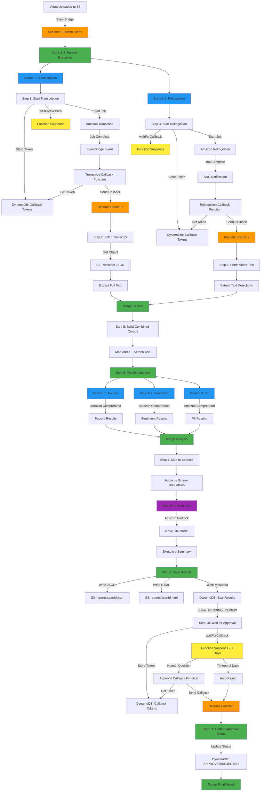

# Video Scanner - Content Analysis Pipeline

A serverless video content analysis pipeline built with AWS Lambda Durable Functions, Amazon Transcribe, and Amazon Comprehend.

## Overview

This application automatically processes video files uploaded to S3, transcribes the audio, and performs comprehensive content analysis including toxicity detection, sentiment analysis, and PII detection.

## Architecture

The system uses AWS Lambda Durable Functions to orchestrate a multi-step workflow that can run for extended periods while maintaining state and handling failures gracefully.

### Workflow Diagram



**Legend:**
- 🟠 Orange: Durable Function Execution
- 🟡 Yellow: Function Suspended (No Compute Charges)
- 🟢 Green: Parallel Execution / Completion
- 🔵 Blue: Concurrent Analysis Branches
- 🟣 Purple: AI Processing

### Components

- **Scanner Function** (Durable): Main orchestrator that coordinates the entire workflow
- **Transcribe Callback Function**: Handles Amazon Transcribe completion events
- **Rekognition Callback Function**: Handles Amazon Rekognition completion events via SNS
- **Approval Callback Function**: Handles human approval decisions with 3-day timeout
- **S3 Bucket**: Stores uploaded videos, transcripts, and scan reports
- **DynamoDB Tables**: 
  - Callback tokens for durable execution (with TTL)
  - Scan results with user-based and approval status indexes
- **EventBridge**: Routes S3 and Transcribe events to Lambda functions
- **SNS Topic**: Routes Rekognition completion notifications

## Durable Function Workflow

The Scanner function implements a fault-tolerant, multi-step workflow using AWS Lambda Durable Functions with proper child context handling for deterministic replay.

### Steps 1-4: Parallel Transcription and Rekognition (with Child Contexts)

The first major optimization is running transcription and video text detection in parallel, reducing total wait time by ~50%. Each parallel branch uses its own child context for deterministic replay:

```typescript
context.parallel([
  // Branch 1: Transcription workflow
  async (childContext) => {
    const transcriptionResult = await childContext.waitForCallback(...)
    const transcriptData = await childContext.step(...)
    return transcriptData;
  },
  
  // Branch 2: Rekognition workflow
  async (childContext) => {
    const rekognitionResult = await childContext.waitForCallback(...)
    const videoTextData = await childContext.step(...)
    return { videoTextData, error: null };
  }
])
```

**Why Child Contexts Matter:**
- Each parallel branch receives its own `childContext` parameter
- All operations within a branch must use the child context (not the parent context)
- This ensures deterministic replay when operations execute in different orders
- Follows AWS Durable Execution SDK best practices

#### Branch 1: Transcription Workflow

**Step 1: Start Transcription Job**
```
childContext.waitForCallback('transcription-result', async (callbackToken) => {
  // Store callback token in DynamoDB
  // Start Amazon Transcribe job
  // Job completion triggers callback via EventBridge
})
```

**What happens:**
- Receives S3 object created event for videos in `raw/{userId}/` prefix
- Generates unique transcription job name
- Stores callback token in DynamoDB with 24-hour TTL
- Starts Amazon Transcribe job with job name as correlation ID
- Function suspends (no compute charges) while waiting for transcription
- Transcribe completion event triggers callback function
- Callback function sends result back to durable execution
- Function resumes with transcription result

**Step 2: Fetch Transcript from S3**
```
childContext.step('fetch-transcript', async () => {
  // Parse transcript URI (supports s3:// and https:// formats)
  // Fetch transcript JSON from S3
  // Extract full text and word-level timestamps
})
```

**What happens:**
- Parses the transcript URI from Transcribe result
- Handles both S3 URI (`s3://bucket/key`) and HTTPS URL formats
- Fetches the transcript JSON file from S3
- Extracts the full transcript text with timestamps
- Returns text and metadata for next step

#### Branch 2: Rekognition Workflow

**Step 3: Start Rekognition Text Detection**
```
childContext.waitForCallback('rekognition-result', async (callbackToken) => {
  // Store callback token in DynamoDB
  // Start Amazon Rekognition text detection job
  // Job completion triggers callback via SNS
})
```

**What happens:**
- Stores callback token in DynamoDB
- Starts Rekognition text detection job on video
- Configures SNS notification channel for job completion
- Function suspends while waiting for text detection
- Rekognition publishes to SNS when complete
- SNS triggers callback function
- Function resumes with job ID

**Step 4: Fetch Video Text Detections**
```
childContext.step('fetch-video-text', async () => {
  // Fetch all text detection results
  // Deduplicate and filter by confidence
  // Extract text with timestamps and bounding boxes
})
```

**What happens:**
- Fetches all text detection results from Rekognition
- Handles pagination for large result sets
- Filters detections by confidence threshold (>80%)
- Deduplicates text across frames
- Returns unique text segments with timestamps

**Parallel Execution Benefits:**
- Both workflows run concurrently instead of sequentially
- Total wait time reduced by approximately 50%
- Results merge before corpus building (Step 5)
- Maintains error handling for Rekognition failures

### Step 5: Build Combined Corpus
```
context.step('build-corpus', async () => {
  // Combine audio transcript and screen text
  // Create position index mapping text to source
  // Track timestamps for both audio and screen
})
```

**What happens:**
- Combines transcript words with video text detections
- Creates position index mapping each word to its source (audio/screen)
- Preserves timestamps for temporal analysis
- Enables source-level issue tracking

### Step 6: Parallel Content Analysis (with Child Contexts)
```
context.parallel([
  async (childContext) => { /* Toxicity Detection */ },
  async (childContext) => { /* Sentiment Analysis */ },
  async (childContext) => { /* PII Detection */ }
])
```

**What happens:**
All three analyses run concurrently on the combined corpus using Amazon Comprehend. Each branch uses its own child context for proper deterministic replay:

#### Branch 1: Toxicity Detection
- Detects 7 types of toxic content:
  - PROFANITY
  - HATE_SPEECH
  - INSULT
  - GRAPHIC
  - HARASSMENT_OR_ABUSE
  - SEXUAL
  - VIOLENCE_OR_THREAT
- Handles large texts by chunking (100KB limit per request)
- Returns confidence scores for each category
- Flags content as toxic if any score > 0.5

#### Branch 2: Sentiment Analysis
- Analyzes overall emotional tone
- Returns sentiment: POSITIVE, NEGATIVE, NEUTRAL, or MIXED
- Provides confidence scores for each sentiment type
- Analyzes first 5KB if text exceeds limit

#### Branch 3: PII Detection
- Detects personally identifiable information:
  - Names
  - Phone numbers
  - Email addresses
  - Credit card numbers
  - SSNs
  - Addresses
  - And more
- Groups entities by type for easy summary
- Returns count, types, and locations of all PII found
- Analyzes first 100KB if text exceeds limit

### Step 7: Map Results to Sources
```
context.step('map-to-sources', async () => {
  // Map PII entities back to audio or screen source
  // Create breakdown by source type
  // Enable targeted remediation
})
```

**What happens:**
- Maps each detected PII entity to its source (audio/screen)
- Uses position index to determine origin
- Creates summary showing issues per source
- Enables targeted content moderation

### Step 8: Generate AI Summary
```
context.step('generate-summary', async () => {
  // Build structured prompt with all analysis results
  // Call Amazon Bedrock Nova Lite model
  // Generate executive summary with recommendations
})
```

**What happens:**
- Constructs comprehensive prompt with all findings
- Calls Amazon Bedrock Nova Lite for cost-effective summarization
- Generates 3-4 sentence executive summary
- Provides overall safety assessment (Safe/Caution/Unsafe)
- Highlights critical findings and recommendations
- Falls back gracefully if AI generation fails

### Step 9: Save Results
```
context.step('save-results', async () => {
  // Generate scanId and extract userId
  // Save full JSON report to S3
  // Generate and save HTML report to S3
  // Save metadata to DynamoDB with PENDING_REVIEW status
})
```

**What happens:**
- Generates unique scanId (UUID)
- Extracts userId from object key (`raw/{userId}/{filename}`)
- Determines overall assessment (SAFE/CAUTION/UNSAFE)
- Saves complete JSON report to S3 (`reports/{scanId}.json`)
- Generates beautiful HTML report with color-coded results
- Saves HTML report to S3 (`reports/{scanId}.html`)
- Stores metadata in DynamoDB with:
  - User-based index for querying user's videos
  - Approval status index for reviewer workflows
  - Sets initial status to PENDING_REVIEW

### Step 10: Wait for Human Approval (3-Day Timeout)
```
context.waitForCallback('human-approval', async (callbackToken) => {
  // Store callback token in DynamoDB with 3-day TTL
  // Function suspends waiting for approval decision
}, { timeout: { seconds: 259200 } }) // 3 days
```

**What happens:**
- Stores approval callback token in DynamoDB
- Function suspends (no compute charges) waiting for human decision
- Reviewer can approve or reject via approval callback function
- If no decision within 3 days, automatically rejects
- Approval callback sends decision back to durable execution
- Function resumes with approval result

**Approval Event Format:**
```json
{
  "scanId": "uuid-here",
  "approved": true,
  "reviewedBy": "reviewer@example.com",
  "comments": "Content looks good"
}
```

**Timeout Handling:**
- After 3 days without approval, automatically rejects
- Sets `reviewedBy: "system"` and adds timeout comment
- Ensures videos don't remain in pending state indefinitely

### Step 11: Update Final Approval Status
```
context.step('update-approval-status', async () => {
  // Update DynamoDB with final approval status
  // Add reviewer information and timestamp
})
```

**What happens:**
- Updates DynamoDB record with final status (APPROVED/REJECTED)
- Adds reviewer information (reviewedBy, reviewedAt, comments)
- Maintains all previous scan data
- Enables querying by approval status for reporting

### Final Result Structure

```json
{
  "scanId": "uuid-here",
  "userId": "user123",
  "objectKey": "raw/user123/video.mp4",
  "objectSize": 12345,
  "overallAssessment": "CAUTION",
  "status": "completed",
  "approvalStatus": "APPROVED",
  "reviewedBy": "reviewer@example.com",
  "reviewedAt": "2026-01-19T12:00:00.000Z",
  "reviewComments": "Content looks good",
  "reportS3Key": "reports/uuid-here.json",
  "htmlReportS3Key": "reports/uuid-here.html",
  "aiSummary": "This video contains moderate concerns...",
  "warnings": []
}
```

## Key Features

### Durable Execution Benefits
- **Automatic Checkpointing**: Each step is checkpointed, allowing recovery from any point
- **Long-Running Workflows**: Can run for up to 7 days with automatic state management
- **No Compute Charges During Waits**: Function suspends while waiting for Transcribe/Rekognition/Approval
- **Fault Tolerance**: Automatic retry and recovery from failures
- **Parallel Execution**: Multiple operations run concurrently for faster results (Steps 1-4 and Step 6)
- **Child Context Pattern**: Proper use of child contexts in parallel branches ensures deterministic replay
- **Human-in-the-Loop**: 3-day approval timeout with automatic rejection fallback
- **Configurable Timeouts**: 30-minute callback timeouts for jobs, 3-day timeout for human approval

### Multi-Source Analysis
- **Audio Transcription**: Full speech-to-text with timestamps
- **Video Text Detection**: OCR for on-screen text with confidence filtering
- **Combined Corpus**: Unified analysis of both audio and visual content
- **Source Mapping**: Track which issues come from audio vs screen

### Content Analysis
- **Comprehensive Safety Checks**: Toxicity detection for content moderation
- **Emotional Intelligence**: Sentiment analysis for understanding tone
- **Privacy Protection**: PII detection for compliance and data protection
- **Scalable**: Handles large transcripts with automatic chunking
- **Source-Level Breakdown**: Separate audio and screen issue tracking

### AI-Powered Insights
- **Executive Summaries**: Amazon Bedrock Nova Lite generates concise summaries
- **Safety Assessments**: Automatic classification (Safe/Caution/Unsafe)
- **Actionable Recommendations**: Clear guidance for content moderation
- **Cost-Effective**: Uses Nova Lite for optimal price-performance

### Reporting & Storage
- **JSON Reports**: Complete detailed analysis in machine-readable format
- **HTML Reports**: Beautiful, color-coded reports for human review
- **DynamoDB Metadata**: Fast queries by user or approval status
- **User-Based Access**: Multi-user support with userId extraction
- **Approval Workflow**: Built-in PENDING_REVIEW status for manual review

## Deployment

### Prerequisites
- AWS SAM CLI installed
- AWS credentials configured
- Node.js 24.x runtime

### Deploy with SAM Sync
```bash
sam sync --watch
```

This command:
- Builds the Lambda functions
- Deploys infrastructure changes
- Watches for code changes and auto-deploys

### Upload a Video
```bash
aws s3 cp video.mp4 s3://YOUR-BUCKET-NAME/raw/user123/video.mp4
```

The workflow automatically triggers when a file is uploaded to the `raw/{userId}/` prefix. The userId is extracted from the path for multi-user support.

### Approve or Reject a Video
After the scan completes, the video enters PENDING_REVIEW status and waits for human approval. To approve or reject:

```bash
# Approve a video
aws lambda invoke \
  --function-name approval-callback-function \
  --payload '{"scanId":"YOUR-SCAN-ID","approved":true,"reviewedBy":"reviewer@example.com","comments":"Looks good"}' \
  response.json

# Reject a video
aws lambda invoke \
  --function-name approval-callback-function \
  --payload '{"scanId":"YOUR-SCAN-ID","approved":false,"reviewedBy":"reviewer@example.com","comments":"Contains inappropriate content"}' \
  response.json
```

**Note**: If no approval decision is made within 3 days, the video is automatically rejected with `reviewedBy: "system"`.

## Monitoring

### CloudWatch Logs
Each function logs detailed information:
- Scanner function: `/aws/lambda/scanner-function`
- Transcribe callback: `/aws/lambda/transcribe-callback-function`
- Rekognition callback: `/aws/lambda/rekognition-callback-function`

### Key Log Events
- Transcription job started
- Rekognition text detection started
- Callback tokens stored/retrieved
- Transcript and video text fetched
- Corpus built with source mapping
- Parallel analysis started
- Individual analysis results
- AI summary generated
- Reports saved to S3 and DynamoDB
- Final workflow completion with full result

### X-Ray Tracing
All functions have X-Ray tracing enabled for distributed tracing and performance analysis.

## Resources Created

- **Lambda Functions**: 4 (Scanner, Transcribe Callback, Rekognition Callback, Approval Callback)
- **S3 Bucket**: 1 (with EventBridge notifications enabled)
- **DynamoDB Tables**: 2 (callback tokens with TTL, scan results with GSIs)
- **SNS Topic**: 1 (Rekognition job notifications)
- **IAM Roles**: Automatically created with least-privilege permissions
- **EventBridge Rules**: 2 (S3 object created, Transcribe job completion)

## Cost Optimization

- **Durable Functions**: No compute charges during waits (can be hours/days)
- **ARM64 Architecture**: Better price-performance ratio
- **Pay-per-use**: Only charged for actual processing time
- **Parallel Execution**: Faster results, less total execution time

## Security

- **Encryption**: DynamoDB encryption at rest, S3 encryption
- **IAM Policies**: Least-privilege access using SAM policy templates
- **VPC**: Can be deployed in VPC for additional isolation
- **Secrets**: Callback tokens stored securely in DynamoDB with TTL

## Development

### Project Structure
```
.
├── src/
│   ├── scanner/              # Durable function orchestrator
│   │   ├── index.ts
│   │   ├── package.json
│   │   └── tsconfig.json
│   ├── transcribe-callback/  # Transcribe event handler
│   │   ├── index.ts
│   │   ├── package.json
│   │   └── tsconfig.json
│   ├── rekognition-callback/ # Rekognition event handler
│   │   ├── index.ts
│   │   ├── package.json
│   │   └── tsconfig.json
│   └── approval-callback/    # Human approval handler
│       ├── index.ts
│       ├── package.json
│       └── tsconfig.json
├── template.yaml             # SAM template
└── samconfig.toml           # SAM configuration
```

### Local Testing
```bash
# Invoke scanner function locally
sam local invoke ScannerFunction -e events/s3-event.json

# Start local API
sam local start-api
```

## Troubleshooting

### Transcription Timeout
- Default callback timeout: 10 minutes
- Adjust in `CALLBACK_CONFIG.timeoutSeconds` if needed

### Large Transcript Handling
- Toxicity: Automatically chunks at 100KB
- Sentiment: Analyzes first 5KB
- PII: Analyzes first 100KB

### Callback Token Not Found
- Check DynamoDB table for token
- Verify TTL hasn't expired (24 hours)
- Check EventBridge rule is triggering callback function

## License

Apache 2.0
