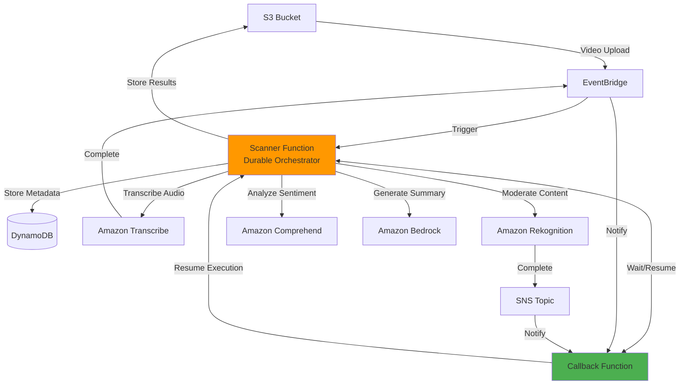
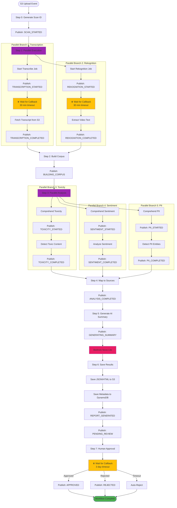

# Video Scanner - Content Analysis Pipeline

A serverless video content analysis pipeline built with AWS Lambda Durable Functions, demonstrating advanced orchestration patterns for long-running workflows with human-in-the-loop approval and real-time UI updates.

## Overview

This application automatically processes video files uploaded to S3, performing comprehensive content analysis through a multi-step durable workflow that can run for days while maintaining state. It demonstrates key durable function patterns including parallel execution, async callbacks, human approval workflows, and real-time progress visualization.

## Architecture



The workflow orchestrates multiple AI services using Lambda Durable Functions, with EventBridge and SNS handling async job completions.

### Durable Function Orchestration Flow



**Legend:**
- 🟣 Purple: Parallel execution points
- 🟡 Yellow: Suspension points (function pauses, state saved)
- 🔴 Pink: AI processing (Bedrock)
- 🟢 Green: Workflow completion

## Key Features

### Durable Execution Benefits
- **Automatic Checkpointing**: Each step is checkpointed, allowing recovery from any point
- **Long-Running Workflows**: Can run for up to 7 days with automatic state management
- **No Compute Charges During Waits**: Function suspends while waiting for Transcribe/Rekognition/Approval
- **Fault Tolerance**: Automatic retry and recovery from failures
- **Parallel Execution**: Multiple operations run concurrently for faster results
- **Child Context Pattern**: Proper use of child contexts in parallel branches ensures deterministic replay
- **Human-in-the-Loop**: 3-day approval timeout with automatic rejection fallback

### Real-Time Progress Visualization
- **Git-Style Fork/Merge UI**: Visual representation of parallel execution branches
- **Live Status Updates**: Real-time progress events via AppSync Events API
- **Multi-Branch Tracking**: Simultaneous display of parallel operations
- **Color-Coded Branches**: Each workflow branch has distinct color shading
  - Transcription: Purple (purple-400 → purple-600)
  - Rekognition: Indigo (indigo-400 → indigo-600)
  - Toxicity: Orange (orange-400 → orange-600)
  - Sentiment: Emerald (emerald-400 → emerald-600)
  - PII: Rose (rose-400 → rose-600)
- **Status History**: Complete tracking of all workflow states

### Multi-Source Analysis
- **Audio Transcription**: Full speech-to-text with timestamps via Amazon Transcribe
- **Video Text Detection**: OCR for on-screen text via Amazon Rekognition
- **Combined Corpus**: Unified analysis of both audio and visual content
- **Source Mapping**: Track which issues come from audio vs screen

### Content Analysis
- **Toxicity Detection**: Content moderation via Amazon Comprehend
- **Sentiment Analysis**: Emotional tone understanding
- **PII Detection**: Privacy protection and compliance
- **Scalable Processing**: Handles large transcripts with automatic chunking

### AI-Powered Insights
- **Executive Summaries**: Amazon Bedrock Nova Lite generates concise summaries
- **Safety Assessments**: Automatic classification (Safe/Caution/Unsafe)
- **Actionable Recommendations**: Clear guidance for content moderation
- **Cost-Effective**: Uses Nova Lite for optimal price-performance

## Workflow Steps

### Step 0: Initialize Scan
- Generate unique scan ID (UUID)
- Create timestamp
- Publish `SCAN_STARTED` event

### Step 1: Parallel Media Processing
**Branch 1 - Transcription:**
1. Start Amazon Transcribe job
2. Store callback token in DynamoDB (24h TTL)
3. Publish `TRANSCRIPTION_STARTED` event
4. ⏸️ Suspend and wait for callback (30 min timeout)
5. Fetch transcript from S3
6. Publish `TRANSCRIPTION_COMPLETED` event

**Branch 2 - Rekognition:**
1. Start Amazon Rekognition text detection job
2. Store callback token in DynamoDB (24h TTL)
3. Publish `REKOGNITION_STARTED` event
4. ⏸️ Suspend and wait for callback (30 min timeout)
5. Extract detected text with confidence filtering
6. Publish `REKOGNITION_COMPLETED` event

### Step 2: Build Combined Corpus
- Merge audio transcript and video text
- Create position index for source mapping
- Publish `BUILDING_CORPUS` event

### Step 3: Parallel Content Analysis
**Branch 3 - Toxicity:**
1. Publish `TOXICITY_STARTED` event
2. Detect toxic content via Comprehend
3. Publish `TOXICITY_COMPLETED` event

**Branch 4 - Sentiment:**
1. Publish `SENTIMENT_STARTED` event
2. Analyze sentiment via Comprehend
3. Publish `SENTIMENT_COMPLETED` event

**Branch 5 - PII:**
1. Publish `PII_STARTED` event
2. Detect PII entities via Comprehend
3. Publish `PII_COMPLETED` event

### Step 4: Map Results to Sources
- Identify which issues came from audio vs screen
- Create source-level breakdown
- Publish `ANALYSIS_COMPLETED` event

### Step 5: Generate AI Summary
- Publish `GENERATING_SUMMARY` event
- Use Amazon Bedrock Nova Lite to generate executive summary
- Determine overall safety assessment

### Step 6: Save Results
- Save JSON report to S3
- Save HTML report to S3
- Save metadata to DynamoDB
- Publish `REPORT_GENERATED` event

### Step 7: Human Approval
- Publish `PENDING_REVIEW` event (goes to user and admin channels)
- Store approval callback token (3 day TTL)
- ⏸️ Suspend and wait for approval (3 day timeout)
- On approval: Publish `APPROVED` event
- On rejection: Publish `REJECTED` event
- On timeout: Auto-reject and publish `REJECTED` event

## Components

### Lambda Functions

**Scanner Function (Durable)**
- Main orchestrator implementing the complete workflow
- Uses child contexts for parallel execution
- Publishes 15+ event types for real-time UI updates
- Handles all suspension points and callbacks

**Callback Function**
- Unified handler for three callback sources:
  - EventBridge (Transcribe completion)
  - SNS (Rekognition completion)
  - API Gateway (Human approval/rejection)
- Resumes durable function execution
- Validates callback tokens

**API Functions**
- `api-scans`: Scan operations (list, get, upload URLs, video URLs, pending reviews)
- `api-users`: User profile and admin operations

### Storage

**S3 Bucket**
- `raw/{userId}/`: Uploaded videos
- `reports/`: JSON and HTML scan reports
- `transcripts/`: Transcribe output files

**DynamoDB Tables**
- Callback tokens with TTL (24h for jobs, 3 days for approval)
- Scan results with GSI1 (user queries) and GSI2 (approval status queries)

### Event Sources

**EventBridge Rules**
- S3 object creation → triggers Scanner
- Transcribe job completion → triggers Callback

**SNS Topic**
- Rekognition job completion → triggers Callback

**AppSync Events API**
- Real-time event publishing to frontend
- User-specific channels: `/default/scan-updates-{userId}`
- Admin channel: `/default/admin-pending-reviews`

### Authentication
- Cognito User Pool for user authentication
- JWT token validation in API functions

## Frontend

### Nuxt.js Dashboard
- Real-time progress visualization
- Git-style fork/merge UI for parallel execution
- Color-coded status badges
- Video playback with scan results
- Admin panel for pending reviews

### Real-Time Updates
- AppSync Events API integration
- Automatic UI updates as workflow progresses
- Status history tracking for accurate visualization

## Deployment

### Prerequisites
- AWS SAM CLI installed
- AWS credentials configured
- Node.js 24.x runtime
- Docker (for local testing)

### Deploy Backend
```bash
# Deploy with auto-sync
sam sync --watch

# Or traditional deployment
sam build
sam deploy --guided
```

During deployment, you'll be prompted for an admin email address. After deployment completes:
1. SAM will output all configuration values needed for the frontend `.env` file
2. Check your email for temporary credentials from Cognito
3. Use these credentials to log into the application
4. As an admin user, you can invite regular users through the admin interface

### Deploy Frontend
```bash
cd frontend
npm install

# Copy the configuration values from SAM deployment output to .env
# The output includes a ready-to-use FrontendEnvFile with all values

npm run dev  # Local development
npm run build  # Production build
```

### Configuration
After SAM deployment, copy the `FrontendEnvFile` output to `frontend/.env`:
```
NUXT_PUBLIC_API_ENDPOINT=https://your-api-id.execute-api.us-west-2.amazonaws.com/prod
NUXT_PUBLIC_USER_POOL_ID=us-west-2_xxxxxxxxx
NUXT_PUBLIC_USER_POOL_CLIENT_ID=xxxxxxxxxxxxxxxxxxxxxxxxxx
NUXT_PUBLIC_APPSYNC_HTTP_ENDPOINT=https://xxx.appsync-api.us-west-2.amazonaws.com/event
NUXT_PUBLIC_APPSYNC_REALTIME_ENDPOINT=wss://xxx.appsync-realtime-api.us-west-2.amazonaws.com/event/realtime
NUXT_PUBLIC_REGION=us-west-2
```

## Usage

You can interact with the application through the web frontend or using AWS CLI commands.

### Upload a Video

**Via Frontend:**
- Log into the dashboard and use the upload interface

**Via CLI:**
```bash
aws s3 cp video.mp4 s3://YOUR-BUCKET/raw/USER_ID/video.mp4 --profile demo
```

### Monitor Progress

**Via Frontend:**
- Watch real-time updates in the dashboard
- See parallel branches execute simultaneously
- Track status through the scan details page

**Via CLI:**
```bash
# Get scan details
aws dynamodb get-item \
  --table-name scanner-table \
  --key '{"PK":{"S":"SCAN#SCAN_ID"},"SK":{"S":"METADATA"}}' \
  --profile demo | jq
```

### Approve or Reject Content

**Via Frontend:**
- Admin users can review pending scans in the admin dashboard
- Click approve or reject with optional comments

**Via CLI:**
```bash
# Get pending reviews
aws dynamodb query \
  --table-name scanner-table \
  --index-name GSI2 \
  --key-condition-expression "GSI2PK = :pk" \
  --expression-attribute-values '{":pk":{"S":"APPROVAL#PENDING"}}' \
  --profile demo | jq

# Approve
sam remote callback succeed TOKEN \
  --result '{"approved":true,"reviewedBy":"admin@example.com","comments":"Looks good"}' \
  --profile demo

# Reject
sam remote callback succeed TOKEN \
  --result '{"approved":false,"reviewedBy":"admin@example.com","comments":"Issues found"}' \
  --profile demo
```

## Monitoring

### CloudWatch Logs
- Scanner function: `/aws/lambda/scanner-app-ScannerFunction-*`
- Callback function: `/aws/lambda/scanner-app-CallbackFunction-*`
- API functions: `/aws/lambda/scanner-app-API*Function-*`

### X-Ray Tracing
All functions have X-Ray tracing enabled for distributed tracing and performance analysis.

### Key Metrics
- Workflow duration
- Parallel execution timing
- Callback response times
- Approval wait times
- Error rates by step

## Cost Optimization

- **Durable Functions**: No compute charges during waits (can be hours/days)
- **ARM64 Architecture**: Better price-performance ratio
- **Parallel Execution**: Faster results, less total execution time
- **Pay-per-use**: Only charged for actual processing time
- **Nova Lite**: Cost-effective AI model for summaries

## Security

- **Encryption**: DynamoDB and S3 encryption at rest
- **IAM Policies**: Least-privilege access using SAM policy templates
- **Cognito Authentication**: Secure user authentication
- **Callback Token Validation**: Prevents unauthorized workflow resumption
- **TTL on Tokens**: Automatic cleanup of expired tokens

## Development

### Project Structure
```
.
├── src/
│   ├── scanner/              # Durable orchestrator
│   ├── callback/             # Unified callback handler
│   ├── api-scans/           # Scan API
│   └── api-users/           # User API
├── frontend/                 # Nuxt.js dashboard
│   ├── pages/
│   ├── components/
│   └── composables/
├── template.yaml            # SAM template
├── samconfig.toml          # SAM configuration
└── Makefile                # Dependency management
```

### Local Testing
```bash
# Invoke scanner locally
sam local invoke ScannerFunction -e events/s3-event.json

# Start local API
sam local start-api

# Run frontend locally
cd frontend && npm run dev
```

## Troubleshooting

### Workflow Not Starting
- Check EventBridge rule is enabled
- Verify S3 bucket has EventBridge notifications enabled
- Check Scanner function logs

### Callback Not Received
- Verify callback token exists in DynamoDB
- Check token hasn't expired (TTL)
- Verify EventBridge/SNS subscriptions
- Check Callback function logs

### UI Not Updating
- Verify AppSync Events API configuration
- Check browser console for WebSocket errors
- Verify Cognito authentication token is valid

### Analysis Failures
- Check Comprehend service limits
- Verify text length is within limits
- Check IAM permissions for Comprehend

## Resources Created

- **Lambda Functions**: 5 (Scanner, Callback, API Scans, API Users, AppSync Authorizer)
- **S3 Bucket**: 1 (with EventBridge notifications)
- **DynamoDB Table**: 1 (with 2 GSIs)
- **SNS Topic**: 1 (Rekognition notifications)
- **EventBridge Rules**: 2 (S3 events, Transcribe completion)
- **AppSync Events API**: 1 (Real-time updates)
- **Cognito User Pool**: 1 (Authentication)
- **API Gateway**: 1 (REST API)
- **IAM Roles**: Auto-created with least-privilege

## License

MIT
